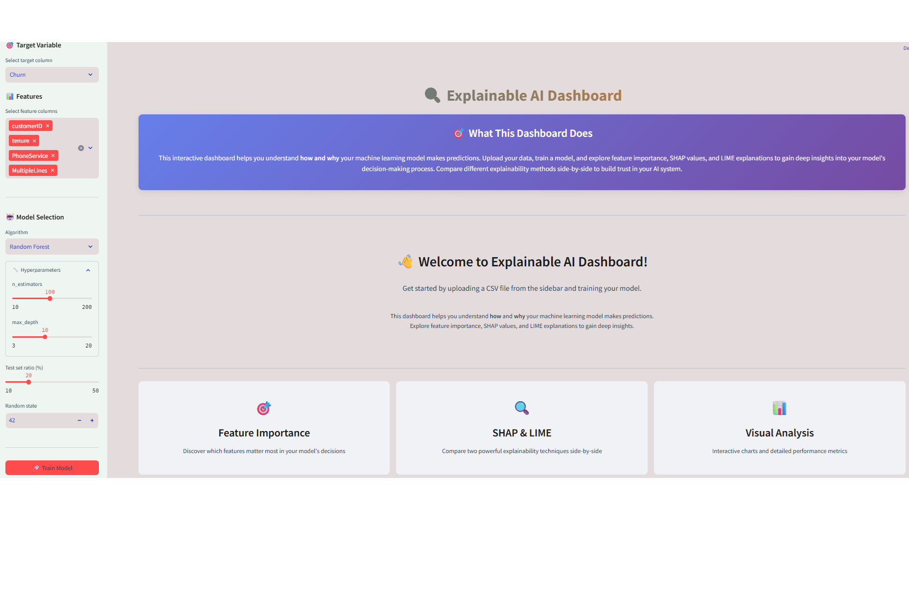
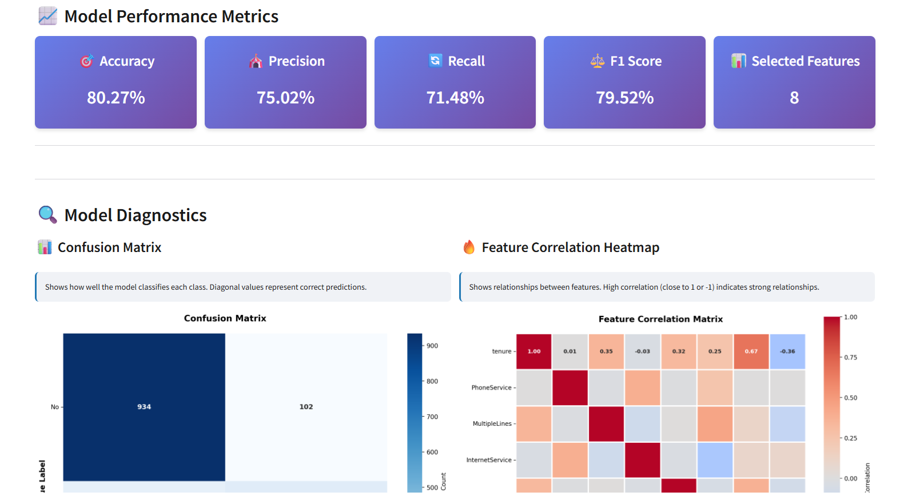
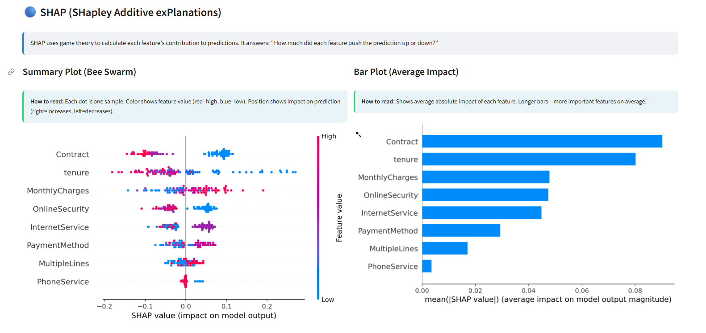
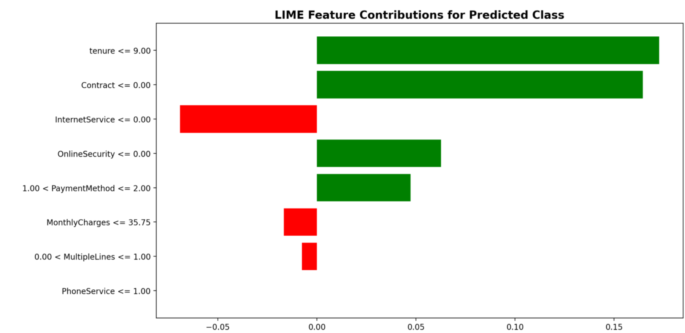

# 🔍 Explainable AI Dashboard


An interactive **Streamlit dashboard** for explaining machine learning model predictions using **SHAP** and **LIME** techniques.

---

## 📷 Dashboard Preview

### Welcome Page


### Model Metrics


### SHAP Analysis


### LIME Analysis


### 🚀 Try the App
You can try the live app here: [Streamlit App](https://your-deploy-link.streamlit.app)
---

## ✨ Features

- 📊 **Feature Importance Analysis** — Discover which features matter most in your model's decisions  
- 🔵 **SHAP Explanations** — Game theory-based feature attribution with global and local insights  
- 🟢 **LIME Explanations** — Model-agnostic local interpretable explanations  
- ⚖️ **SHAP vs LIME Comparison** — Side-by-side comparison of both explainability methods  
- 📈 **Performance Metrics** — Accuracy, Precision, Recall, F1-Score  
- 🔥 **Correlation Heatmap** — Visualize feature relationships  
- 🎯 **Confusion Matrix** — Detailed classification performance  
- 💡 **Multi-class Support** — Works with binary and multi-class classification problems  

---

## 🚀 Quick Start

```bash
git clone https://github.com/AtamerErkal/explainable_ai_dashboard.git
cd explainable_ai_dashboard

# Create virtual environment
python -m venv venv

# Activate venv
# On Windows
venv\Scripts\activate
# On Linux/MacOS
source venv/bin/activate

# Install requirements
pip install -r requirements.txt

# Run the app
streamlit run dashboard.py

```

👉 Your app will launch in your default web browser.  
If it doesn’t open automatically, open: http://localhost:8501  

# 📖 Usage Guide  

## Step 1: Upload Data
- Click "Browse files" in the sidebar  
- Upload your CSV file  
- Preview your data  

## Step 2: Configure Model
- Select target variable  
- Choose features to include  
- Select a machine learning algorithm:  
  - Random Forest  
  - Gradient Boosting  
  - Logistic Regression  

## Step 3: Train Model
- Adjust hyperparameters  
- Set train/test split ratio  
- Click "🚀 Train Model"  

## Step 4: Analyze Results  

Explore four powerful analysis tabs:

### 🎯 Feature Importance
- Bar chart showing most important features  
- Top 5 features ranked by importance  

### 🔵 SHAP Analysis
- Summary Plot: Feature impact across all samples  
- Bar Plot: Average absolute impact  
- Waterfall Plot: Individual prediction explanations  
- Multi-class support with per-class visualizations  

### 🟢 LIME Analysis
- Local explanations for individual predictions  
- Feature contributions with conditions  
- Multi-class support with tabs for each class  

### ⚖️ SHAP vs LIME Comparison
- Side-by-side comparison  
- Understand strengths and weaknesses  
- Method characteristics summary  

---

## 📊 Supported Models
- Random Forest Classifier — Ensemble of decision trees  
- Gradient Boosting Classifier — Sequential ensemble method  
- Logistic Regression — Linear classification model  

---

## 🔧 Requirements
```bash
streamlit==1.27.0
pandas==2.0.3
numpy==1.26.0
scikit-learn==1.3.0
matplotlib==3.8.0
seaborn==0.12.2
shap==0.44.0
lime==0.2.0.1
plotly==5.20.0
numba==0.59.0
llvmlite==0.42.0

```


See requirements.txt for full list.  

---

## 📝 Example Datasets
Works with any classification dataset in CSV format. Try:  
- Titanic Dataset — Predict survival  
- Iris Dataset — Classify flower species  
- Wine Quality — Predict wine ratings  
- Customer Churn — Predict customer attrition  

Dataset Requirements:  
- CSV format  
- One target column  
- Remaining columns as features  
- Supports numeric and categorical features  
- Handles missing values automatically  

---

## 🤝 Contributing
Contributions are welcome!  

### Fork and clone
```bash
git checkout -b feature/AmazingFeature
git commit -m "Add AmazingFeature"
git push origin feature/AmazingFeature

```

Then open a Pull Request 🚀  

---

## 📄 License

This project is licensed under the MIT License - see the [LICENSE](LICENSE) file for details.  

---

## 🙏 Acknowledgments

- [SHAP](https://github.com/slundberg/shap) - SHapley Additive exPlanations  
- [LIME](https://github.com/marcotcr/lime) - Local Interpretable Model-agnostic Explanations  
- [Streamlit](https://streamlit.io/) - The fastest way to build data apps  
- [scikit-learn](https://scikit-learn.org/) - Machine learning in Python  

---

## 📧 Contact

Atamer Erkal - [LinkedIn](https://www.linkedin.com/in/atamererkal/)

Project Link: [https://github.com/AtamerErkal/explainable_ai_dashboard](https://github.com/AtamerErkal/explainable_ai_dashboard)  

---

## 🎓 Learn More

- [Understanding SHAP](https://christophm.github.io/interpretable-ml-book/shap.html)  
- [Understanding LIME](https://christophm.github.io/interpretable-ml-book/lime.html)  
- [Explainable AI Guide](https://www.oreilly.com/library/view/interpretable-machine-learning/9781492033158/)  

---

⭐ If you find this project helpful, please give it a star!

